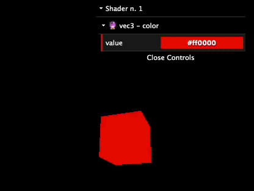
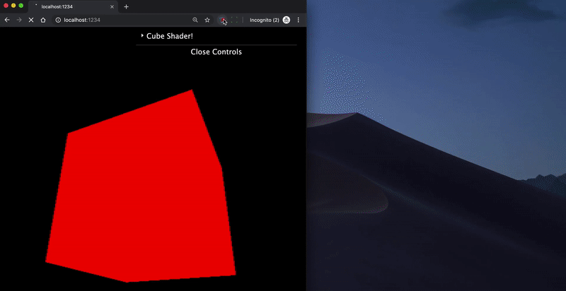

# 🔮 MagicShader

A thin wrapper on top of `RawShaderMaterial`, that allows to easily create new uniforms and live-edit them via `dat.gui`.

No need to create the uniforms manually and bind them with `dat.gui`.  
Just write some comments in your GLSL, and everything will work magically ✨


## 🕵️‍♂️ How to use
Install via npm

```
npm i -D magicshader
```

and just use it instead of `RawShaderMaterial`:

```javascript
import MagicShader from 'magicshader';

const material = new MagicShader({...})
```

The parameters are exactly the same.

## 🤷‍♀️ Ok...where the magic is?

Now you can add the `// ms({})`  magic comment after your uniforms.


Example:

```javascript
const material = new MagicShader({
  vertexShader: `
    precision highp float;
    
    attribute vec3 position;
    uniform mat4 modelViewMatrix;
    uniform mat4 projectionMatrix;
    
    void main() {
      gl_Position = projectionMatrix * modelViewMatrix * vec4(position, 1.0);
    }
  `,
  fragmentShader: `
    precision highp float;

    uniform vec3 color; // ms({ value: '#ff0000' })

    void main() {
      gl_FragColor = vec4(color, 1.0);
    }
  `
});
```

This will give you:  


No need to init your uniform or bind `dat.gui`.  
You can just work on your GLSL files.


## 👨‍💻 What else?
```javascript
const material = new MagicShader({
  name: 'Cube Shader!',
  vertexShader: `
    precision highp float;
    
    attribute vec3 position;
    uniform mat4 modelViewMatrix;
    uniform mat4 projectionMatrix;

    uniform vec3 translate; // ms({ value: [0, 0, 0], step: 0.01 })
    uniform float scale; // ms({ value: 0.5, options: { small: 0.5, medium: 1, big: 2 } })
    uniform mat4 aMatrix4; // ms({ value: [0, 0, 0, 0, 0, 0, 0, 0, 0, 0, 0, 0, 0, 0, 0, 0] })

    void main() {
      vec3 pos = position + translate;
      pos *= scale;

      gl_Position = projectionMatrix * modelViewMatrix * vec4(pos, 1.0);
    }
  `,
  fragmentShader: `
    precision highp float;
    
    uniform vec3 color; // ms({ value: '#ff0000' })
    uniform float brightness; // ms({ value: 0, range: [0, 0.5], step: 0.1 })
    uniform vec2 dummyValue; // ms({ value: [1024, 768], range: [[0, 2000], [0, 1500]] })
    uniform bool visible; // ms({ value: 1, name: 'Visibility' })
    uniform int test; // ms({ value: 0 })

    void main() {
      gl_FragColor = vec4(color + brightness, 1.0);
    }
  `
});
```

Will result in:  


## 🕵️‍ SpectorJS

With the [SpectorJS extension](https://github.com/BabylonJS/Spector.js/blob/master/documentation/extension.md) enabled, you can live-edit the shaders. You can even add and modify "magic" uniforms on the fly.



## 💅 Ok, cool. Just finished my app and I'm ready to deploy

Then you can hide the `dat.gui` UI
```javascript
import MagicShader, { gui } from 'magicshader';
gui.destroy();
```


## 😴 TODO

- [ ] Do more tests...
- [ ] add support for sampler2D and FBO?
- [ ] check if it works with firefox/safari shader editor
- [ ] inspect/edit threejs default uniforms (like `projectionMatrix`)
